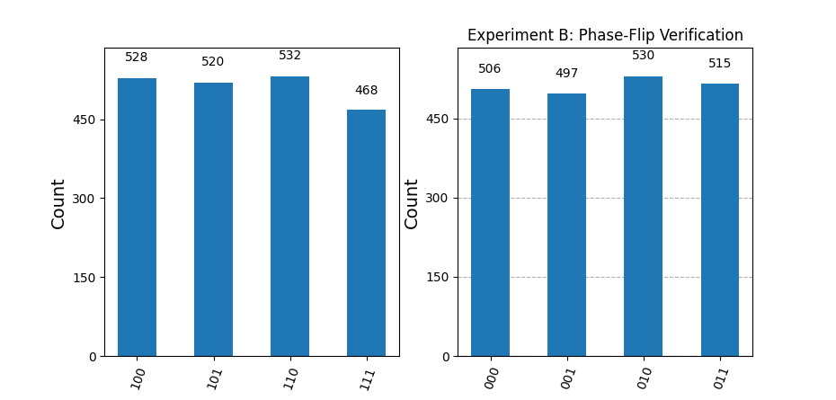

# ⚛️ Quantum Circuit Proofs & Experiments


A collection of quantum algorithms designed, implemented, and verified using **Qiskit** and the **Aer Simulator**. This repository documents my work in validating fundamental quantum mechanics phenomena through code.

## 📂 Project 1: Quantum Teleportation & Phase Analysis

This module implements the quantum teleportation protocol to transfer a qubit's state to a remote target using entanglement (Bell States) and classical communication.

### 🔬 Key Concepts Implemented
* **Entanglement Creation:** Generating Bell pairs to link qubits $q_1$ and $q_2$.
* **Basis Change:** Applying Hadamard gates to translate phase information into measurable bit-flips.
* **Dynamic Circuits:** Using `if_test` to apply conditional logic based on mid-circuit measurements.
* **State Reconstruction:** verifying the state was successfully "teleported" to the destination qubit.

---

## 📊 Visual Verification

*(These results were generated directly from the execution of the circuit scripts)*

### 1. Circuit Architecture
The following diagram illustrates the gate logic used for the teleportation protocol, including the Bell measurement and conditional X/Z corrections.


### 2. Execution Results
Histogram analysis confirming the probability distribution of the measured states.



---

## 🛠️ Usage

To replicate these experiments:

1.  **Clone the repository**
    ```bash
    git clone [https://github.com/CosmicLM/quantum-projects.git](https://github.com/CosmicLM/quantum-projects.git)
    cd quantum-projects
    ```

2.  **Install dependencies**
    ```bash
    pip install -r requirements.txt
    ```

3.  **Run the analysis**
    ```bash
    # Navigate to the study module
    cd teleportation_phase_study
    python main.py
    ```

## 🧩 Structure
* `quantum_teleportation.py`: Core logic for the teleportation protocol and qubit setup.
* `phase_analyzer.py`: Logic for analyzing phase relationships.
* `main.py`: Orchestrator script that compiles the circuits and runs the Aer simulator.

---

### Project 2: Fault Tolerance

## Project Overview
This project implements a 3-qubit bit-flip error correction code to demonstrate the principles of Fault-Tolerant Quantum Computing. The primary objective is to validate data reliability by detecting and correcting errors without measuring—and thus destroying—the quantum information itself.

## Architecture
The circuit utilizes a total of 5 qubits:

3 Data Qubits: Used to encode 1 Logical Qubit of information (redundancy).

2 Ancilla Qubits: Used for non-destructive syndrome extraction.

## Workflow
Encoding: A single logical qubit is encoded across three physical qubits to establish protection against single bit-flip errors.

Noise Simulation: An error is artificially introduced into the system by applying an X-gate (bit-flip) to one of the data transmission lines.

Syndrome Extraction: We utilize Ancilla qubits to measure the parity (relationship) between neighboring data qubits. This allows us to detect errors indirectly without collapsing the data's superposition.

Correction: A conditional lookup table processes the syndrome measurements to identify the location of the error and applies a corrective gate to restore the original state.


### 👤 Author
**Eduardo de Souza Lima**
* [GitHub Profile](https://github.com/CosmicLM)
* [LinkedIn](https://linkedin.com/in/edusouzalima)
